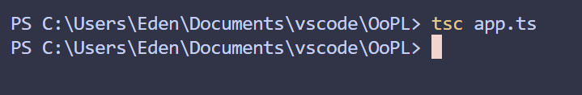
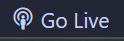

# TypeScript Presentation Part-2
by Edwin Serna and Yusuf Oraby
</img>
## Table of Contents
- [Setup](#setup)
    - [Step 1 - node.js](#step-1---nodejs)
    - [Step 2 - Installing TypeScript](#step-2---installing-typescript)
    - [Step 3 - Compile](#step-3---compile)
- [Running Program](#running-program)
- [Resources](#resources)

---

# Setup
### This setup will be on **Visual Studio Code** with **Windows**.<br>
*If you have another **IDLE** or **OS**, I would recommend looking at resources [links here](#resources)*

## Step 1 - Node.js
If you want to run TypeScript on the server side, to interact with the file system, or to utilize npm packages in your TypeScript projects, then Node.js would be necessary.<br>
Node.js allows you to run JavaScript code outside of the browser environment, making it suitable for backend development, command-line tools, and more.
#### Install latest [Node.js](https://nodejs.org/en/) LTS from [https://nodejs.org/en/](https://nodejs.org/en/)


<div align="center"> <b>Optional</b> - Verify with <b><i>Command Prompt</i></b> by typing <b>'node.v'</b><br>output should be like '<b>V20.12.1'</b></div>


## Step 2 - Installing TypeScript
#### 1. Open up a **command prompt**
#### 2. Type the command ```npm install -g typescript```
##### npm (Node Package Manager)

<div align="center"> <b>Optional</b> - Verify with <b><i>Command Prompt</i></b> by typing <b>'tsc -v'</b><br>output should be like '<b>'Version 5.4.4'</b></div>

## Step 3 - Compile
#### While in the relative path of code type ```tsc app.ts``` in the console teminal to compile TypeScript code into JavaScript using TypeScript compiler (tsc)


---

# Running Program
#### You can run the generated JavaScript file using the HTML file
- Download Extention [Live Server](https://marketplace.visualstudio.com/items?itemName=ritwickdey.LiveServer) for VScode 
- While on [index.html](index.html), click "**Go Live**" on the bottom right-hand side corner 
- Should open a web page looking like this 

---
# Resources
- [MAC Setup]()
- [Linux Setup]()
- [TypeScript Documentation]()
- [Node.js](https://nodejs.org/en/)

---
<div align="center">End of README.md (: </div>
