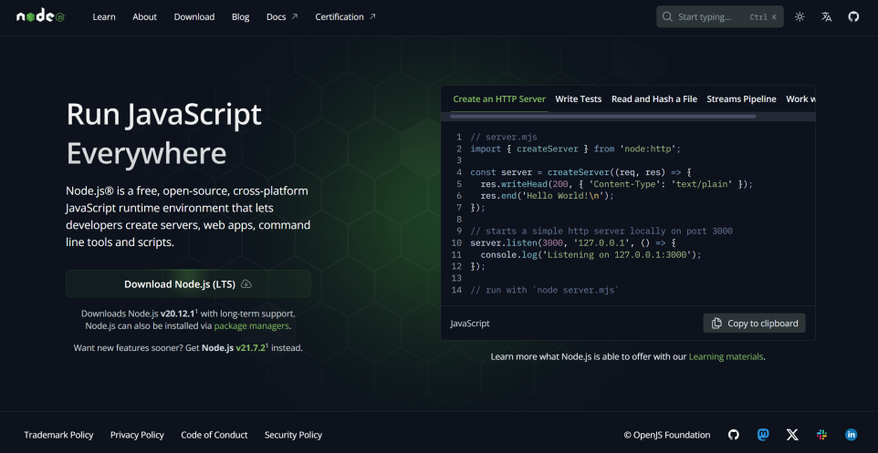
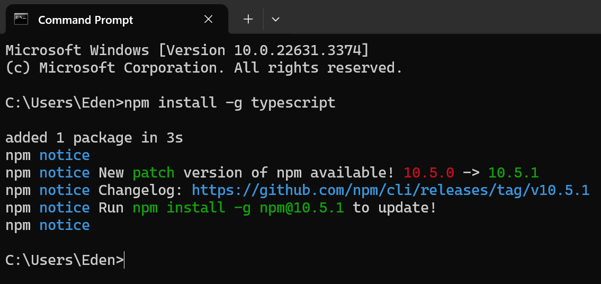
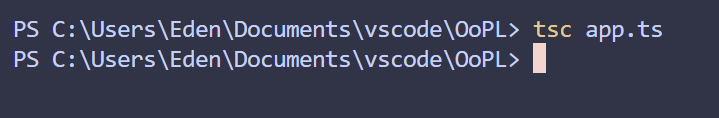
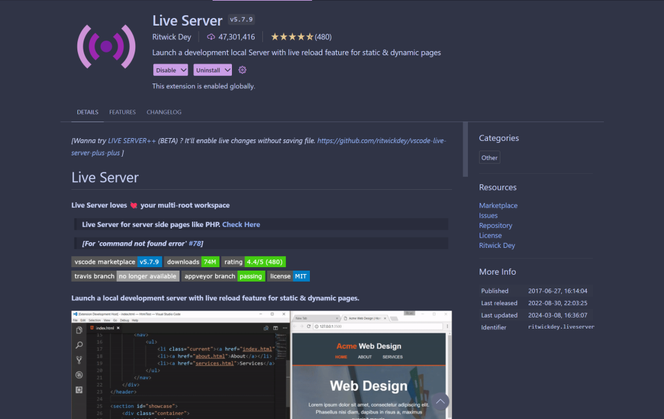
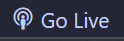
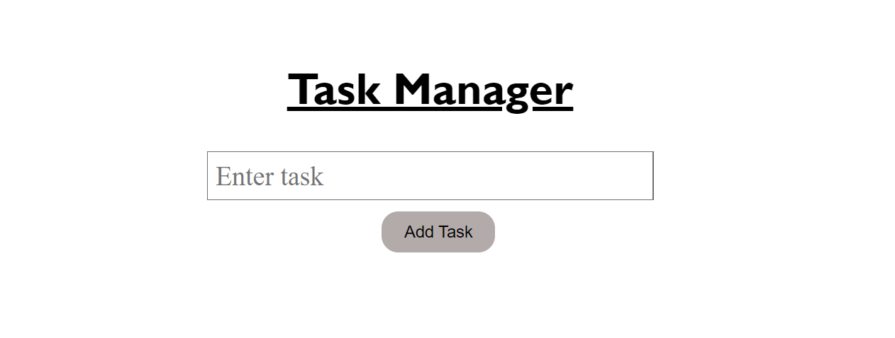
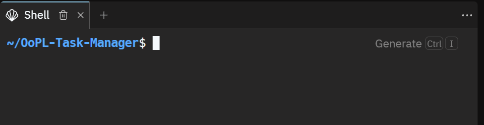
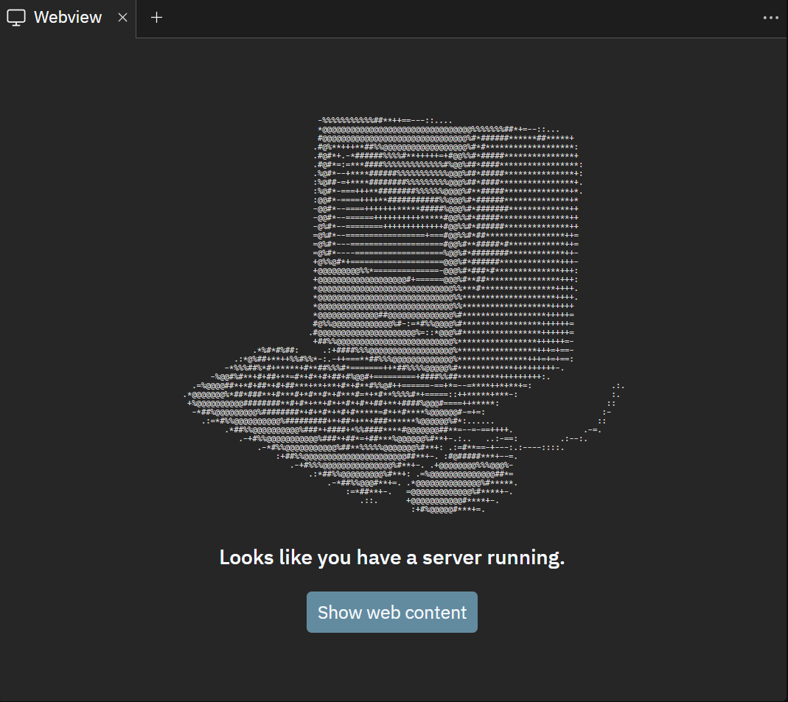
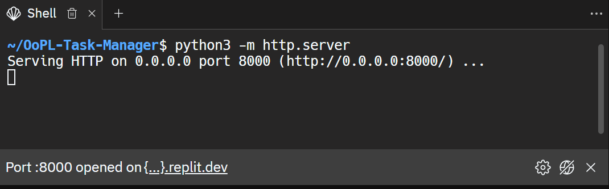

# TypeScript Presentation Part-2
### by Edwin Serna and Yusuf Oraby
## Replit [https://replit.com/@edenpandaboi/OoPL-Task-Manager](https://replit.com/@edenpandaboi/OoPL-Task-Manager)
## GitHub repo [https://github.com/pandaboi1/OoPL](https://github.com/pandaboi1/OoPL)
</img><br>
This is a project to allows the user to use an ***interactive website*** to **create** and **delete** task they wish to complete.<br>
This was created using **HTML**, **CSS**, **TypeScript** and **JavaScript**.<br>
**Objective** of this project was to demonstrate the use of **TypeScript** and how it can be used in a program
## Table of Contents
- [Setup](#setup)
    - [Step 1 - node.js](#step-1---nodejs)
    - [Step 2 - Installing TypeScript](#step-2---installing-typescript)
    - [Step 3 - Compile](#step-3---compile)
- [Running Program](#running-program)
    - [On VScode](#on-vscode)
    - [On Replit](3on-replit)
- [Resources](#resources)

---

# Setup
### This setup will be on **Visual Studio Code** with **Windows**.<br>
*If you have another **IDLE** or **OS**, I would recommend looking at resources [links here](#resources)*

## Step 1 - Node.js
If you want to run TypeScript on the server side, to interact with the file system, or to utilize npm packages in your TypeScript projects, then Node.js would be necessary.<br>
Node.js allows you to run JavaScript code outside of the browser environment, making it suitable for backend development, command-line tools, and more.
#### Install latest [Node.js](https://nodejs.org/en/) LTS from [https://nodejs.org/en/](https://nodejs.org/en/)



<div align="center"> <b>Optional</b> - Verify with Command Prompt by typing 'node.v'<br>output should be like 'V20.12.1'</div>


## Step 2 - Installing TypeScript
#### 1. Open up a **command prompt**
#### 2. Type the command ```npm install -g typescript```
##### npm (Node Package Manager)

<div align="center"> <b>Optional</b> - Verify with Command Prompt by typing 'tsc -v'<br>output should be like 'Version 5.4.4'</div>

## Step 3 - Compile
#### While in the relative path of code type ```tsc app.ts``` in the console teminal to compile TypeScript code into JavaScript using TypeScript compiler (tsc)


---

# Running Program
#### You can run the generated JavaScript file using the HTML file
### On VScode
- Download Extention [Live Server](https://marketplace.visualstudio.com/items?itemName=ritwickdey.LiveServer) for VScode 
- While on [index.html](index.html), click "**Go Live**" on the bottom right-hand side corner 
- Should open a web page looking like this 
### On Replit
- Open up a **shell window** 
- Make sure server is installed with ```python3 -m http.server```
- Click the link at the bottom of the window 
- Click "Show web content" in **Webview** window 

---
# Resources
- [TypeScript](https://www.typescriptlang.org/download)
- [MAC Setup](https://manwithcode.com/554/how-to-install-typescript-on-macos/)
- [Linux Setup](https://manwithcode.com/557/how-to-install-typescript-on-linux/)
- [TypeScript Documentation](https://www.typescriptlang.org/docs/)
- [Node.js](https://nodejs.org/en/)

---
<div align="center">End of README.md (: </div>
